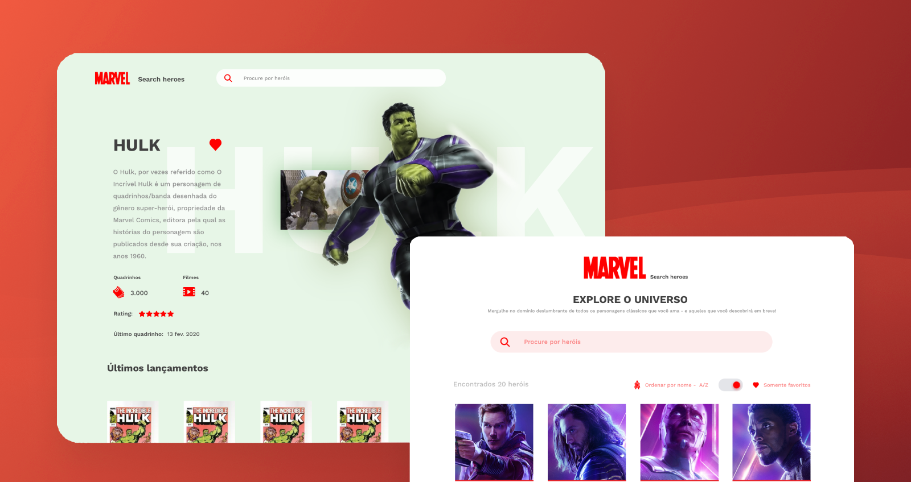

<h1 align="center">
  
</h1>



<p align="center">
  <a href="#-sobre">Sobre</a>&nbsp;&nbsp;&nbsp;|&nbsp;&nbsp;&nbsp;
  <a href="#-métricas">Métricas</a>&nbsp;&nbsp;&nbsp;|&nbsp;&nbsp;&nbsp;
  <a href="#-tecnologias">Tecnologias</a>&nbsp;&nbsp;&nbsp;|&nbsp;&nbsp;&nbsp;
  <a href="#-instalação">Instalação</a>&nbsp;&nbsp;&nbsp;
</p>

<p align="center">
  <a href="https://marvel-spa-samuelhiroyuki.vercel.app/">Live Preview</a>
</p>

## 📝 Sobre
Este desafio consiste no desenvolvimento de uma aplicação para pesquisa de personagens da [Marvel](https://www.marvel.com/characters).

As funcionalidades incluem: 
 - Listagem paginada
 - Ordenação
 - Favoritar heróis
 - Filtro de favoritos
 - Pesquisa
 - Detalhes do herói (como seus últimos quadrinhos)

<br />

## 📊 Métricas
<div align="center">

</div>

<br />

## 💻 Tecnologias
 A aplicação [Marvel Search Heroes](https://marvel-spa-samuelhiroyuki.vercel.app/) foi desenvolvida utilizando como base [Next.js](https://github.com/vercel/next.js), em conjunto com: 
 - Estilização: [Tailwind CSS](https://github.com/tailwindlabs/tailwindcss)
 - Testes: [Cypress](https://github.com/cypress-io/cypress)
 - Deploy: [Vercel](https://vercel.com/)
### Features
 - SSR
 - Server Components
 - Server Actions
 - Route handlers
 - Cookies
 - Cache
 - SEO
 - Query State

<br />

## 💾 Instalação
Inicie o servidor de desenvolvimento:

```bash
npm run dev
# ou
yarn dev
# ou
pnpm dev
```

Abra [http://localhost:3000](http://localhost:3000) em seu navegador.

<br />

